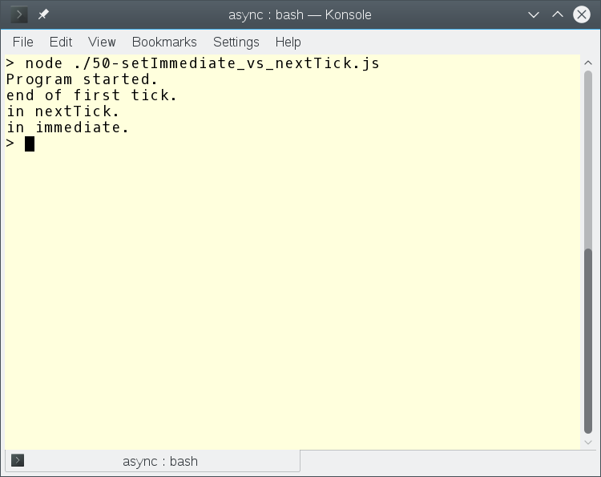
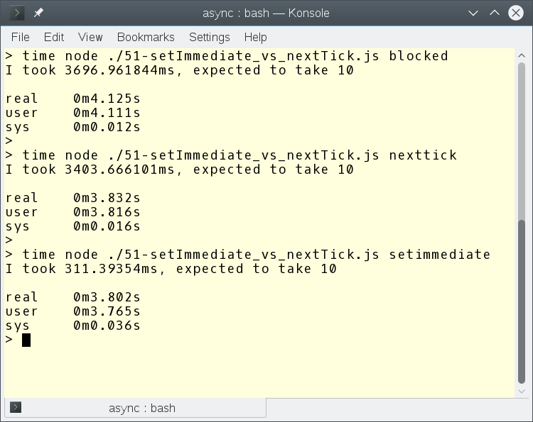

___
## Agenda
> When and how do we ~~do~~ use async functions?

as a quick intro -- just to cover the basics

> How does EventLoop handle async functions in Node.js?

libuv is the engine behind Nodejs

> ~~Different~~ Differences between setTimeout & setInterval in browser and Node.js

> What are setImmediate and nextTick?

___
#_INSERT SLIDE?_
## sync vs async 
_some image here?_
```javascript
/**  add some code here?? **/
```

`Synchronous way`: It waits for each operation to complete, after that only it executes the next operation. For your query: The console.log() command will not be executed until & unless the query has finished executing to get all the result from Database.

`Asynchronous way`: It never waits for each operation to complete, rather it executes all operations in the first GO only. The result of each operation will be handled once the result is available. For your query: The console.log() command will be executed soon after the Database.Query() method. While the Database query runs in the background and loads the result once it is finished retrieving the data.


## When do we need async functions?
_add db's queries??_

___
## Sync functions

___
## Callbacks

___

## Promises

___

## Async functions

---
## Async library

---
## Event Loop


---
# _move this slide after setTimeout, setInterval, setImmediate into?_
## ~~EventLoop's~~ Event Loop phases
* concurrency pattern!
JS can do only one thing at a time, but we still can do things concurrently.

Dispatch in chronological order:

* timer handles (drives `setTimeout` / `setInterval`)
* I/O callbacks
* idle handles (these are pretty much irrelevant to node.js code)
* prepare handles (ditto)
* I/O polling for new events, may block if no work is queued
* check handles (drives setImmediate)
* handle close callbacks

Where's `process.nextTick()`? Basically after each of the above steps

---

## Timers
* setTimeout - clearTimeout
* setInterval - clearInterval

---

#INSERT SLIDE?
## SetImmediate
* SetImmediate -- clearImmediate

---

## Timers ref/unref

---

## NextTick

---


## gotcha #1
### aka "`setImmediate()` is not always very immediate"

https://github.com/nodejs/node-v0.x-archive/issues/5798

`setImmediate()` does what `process.nextTick()` says it does 
but actually doesn't: schedule the callback at the end of the current 
tick / start of the next tick. 

That said, I believe the current `setImmediate()` implementation has a 
bug where it spreads out multiple callbacks over several ticks, i.e. 
one callback per tick.  Tracking issue is 
https://github.com/joyent/node/issues/5798 


```javascript
/// listing 50-setImmediate_vs_nextTick.js

console.log('Program started.');

setImmediate(function() {
  console.log('in immediate.');
  // another tick ends here
});

process.nextTick(function() {
  console.log('in nextTick.');
  // no tick ends here - another process.nextTick
  // would just append to the current tick's queue
});

console.log('end of first tick.');
// first tick ends here
```

---

# _INSERT SLIDE?_
## gotcha #2: nextTick starves the Event Loop!

https://gist.github.com/brycebaril/ff86eeb90b53fd0c523e
 
@mafintosh asks: "Does anyone have a good code example of when to use `setImmediate` instead of `nextTick`?"

https://twitter.com/mafintosh/startus/624590818125352960

The answer is "generally anywhere outside of core".

`process.nextTick` is barely asynchronous. Flow-wise it is asynchronous, but it will trigger before any other asynchronous events can (timers, io, etc.) and thus can starve the event loop.

In this script I show a starved event loop where I just synchronously block, use `nextTick` and `setImmediate`

``` javascript
///listing 51-setImmediate_vs_nextTick.js

var loops = 11
function run() {
  loops--
  for (var i = 0; i < 1e7; i++) {
    Math.pow(Math.random(), Math.random())
  }
  if (loops > 0) {
    if (process.argv[2] == "blocked") {
      run()
    }
    if (process.argv[2] == "nexttick") {
      process.nextTick(run)
    }
    if (process.argv[2] == "setimmediate") {
      setImmediate(run)
    }
  }
}

var delay = 10
var start = process.hrtime()
setTimeout(function () {
  var elapsed = process.hrtime(start)
  var ms_elapsed = (elapsed[0] * 1000) + (elapsed[1] / 1e6)
  console.log("I took %sms, expected to take %s", ms_elapsed, delay)
}, delay)

run()

```



---

## NextTick vs setImmediate

---